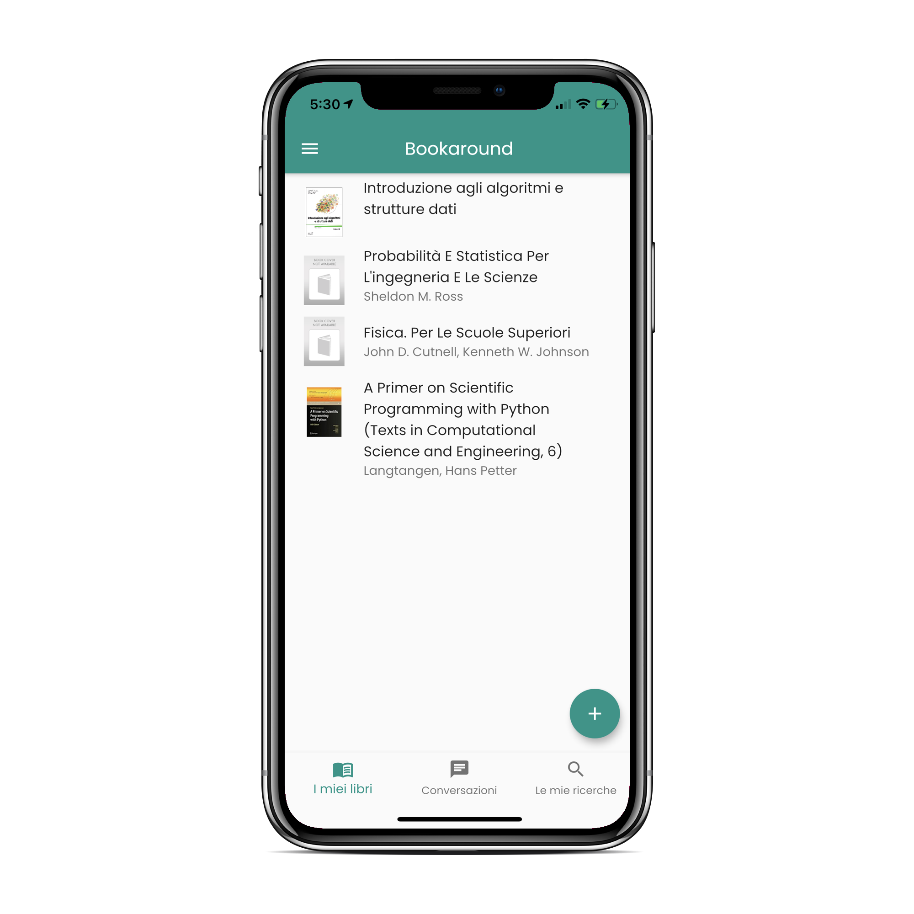
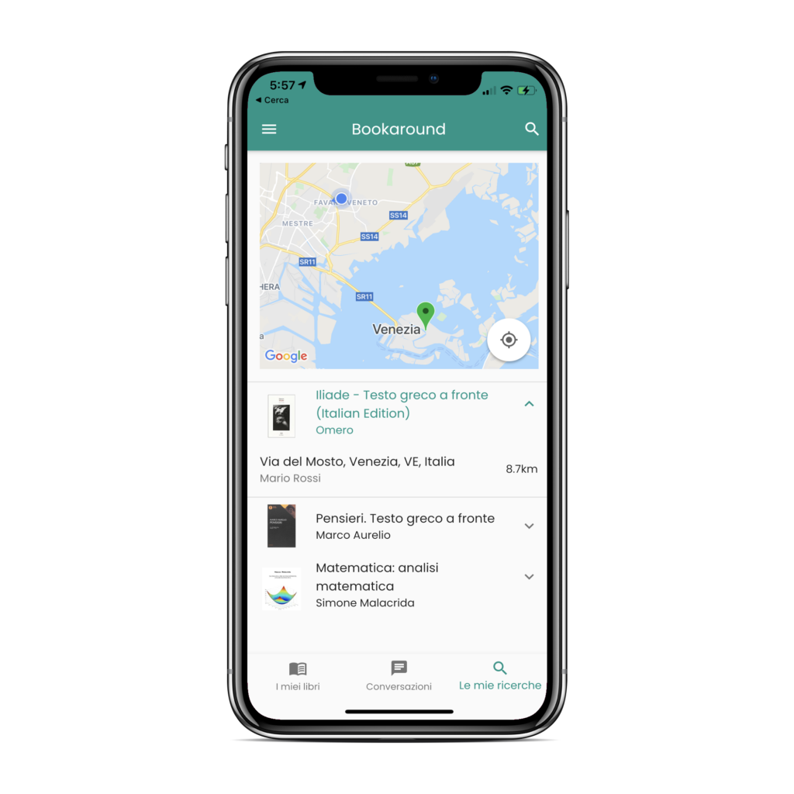
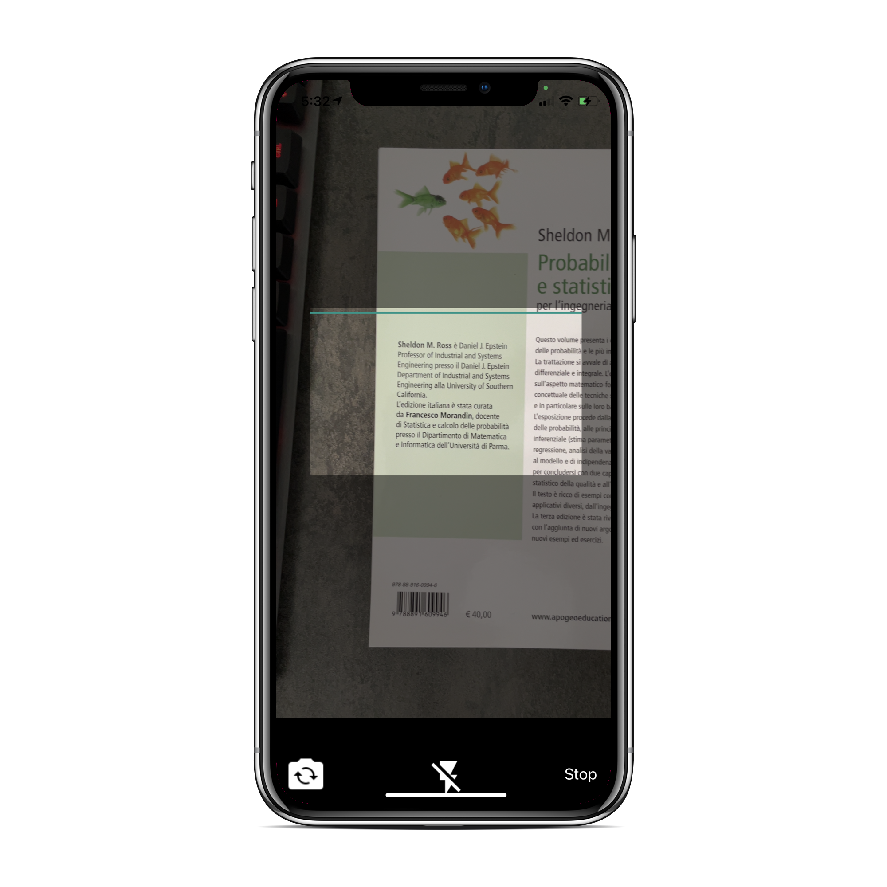
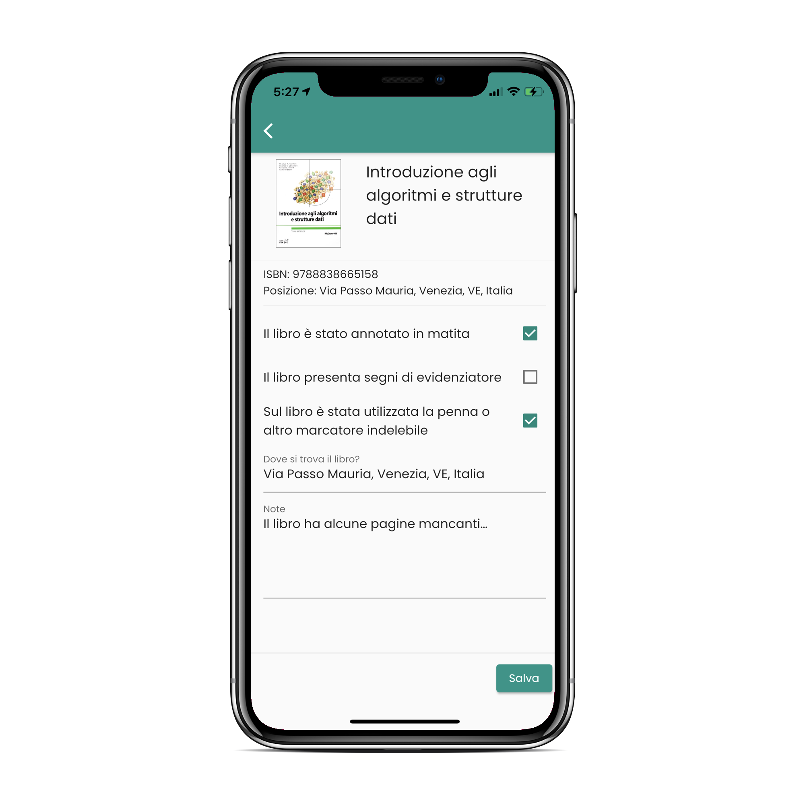
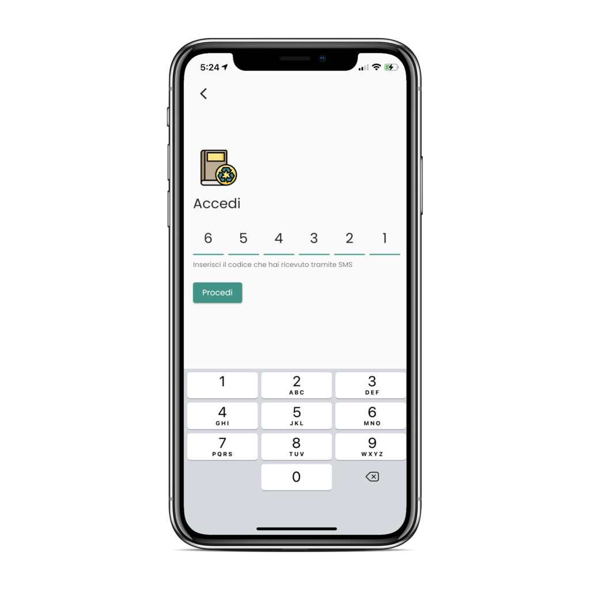
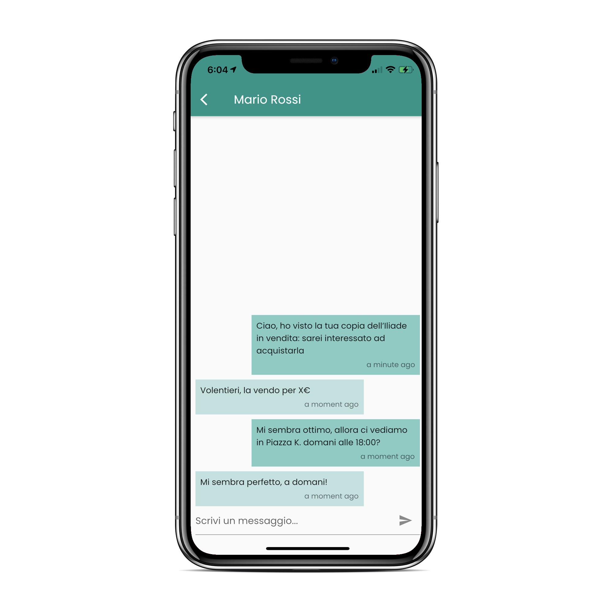

After recently resigning from [PwC](https://www.pwc.com/gx/en.html) to pursue my Master's degree in HPC Engineering at Politecnico di Milano, I'm excited to return to a passion project close to my heart: [Bookaround](https://bookaround.app).

Bookaround was born to help students buy and sell used school books easily, fostering an affordable and sustainable market for second-hand educational materials. [It was originally built with Flutter and Firebase](https://github.com/emiliodallatorre/bookaround), with plenty of [cool features](https://emiliodallatorre.it/2023/09/29/bookaround/) to make selling books an easy game, I'm now planning a complete rewrite using Spring Boot for the backend and Flutter for the frontend to significantly enhance scalability, maintainability, and customization.

This is a non-profit project, driven by the belief that accessible and affordable school books are essential for education. Although nobody is currently profiting from Bookaround, "non-profit" doesn't mean "non-paid". If financial opportunities arise, I'm ready to share equity with contributors and co-founders.

Who am I looking for?

- Software engineers or developers passionate about supporting education and sustainability through technology
- Experience with Java Spring Boot or Flutter development is highly appreciated
- Collaborative individuals ready to build from scratch and contribute actively

If you're interested in joining this journey to rebuild Bookaround into a robust, open-source platform for affordable school book exchange, you really should join!

[join the project](https://forms.gle/siFKHRcwdMY3EcZK7)

Let's create something impactful together!
